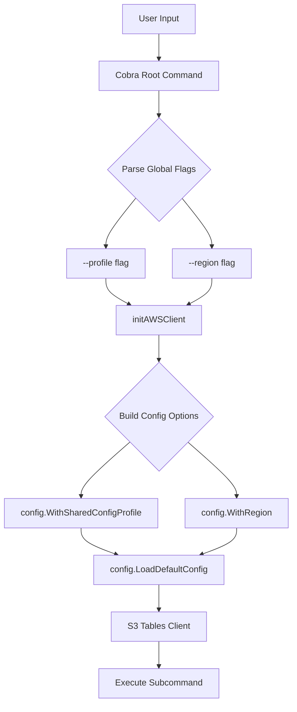

# Design Document: AWS Profile & Region Options

## Overview

S3 Tables CLI に `--profile` と `--region` グローバルフラグを追加し、ユーザーが AWS 認証情報とリージョンを柔軟に指定できるようにする。これらのオプションは Cobra の PersistentFlags として実装され、すべてのサブコマンドで利用可能となる。

## Architecture



## Components and Interfaces

### 1. Root Command (cmd/root.go)

グローバルフラグの定義と AWS クライアント初期化を担当する。

```go
var (
    // Global flags
    awsProfile string
    awsRegion  string
)

func init() {
    // Add global flags
    rootCmd.PersistentFlags().StringVar(&awsProfile, "profile", "", "AWS profile name to use")
    rootCmd.PersistentFlags().StringVar(&awsRegion, "region", "", "AWS region to use")
}
```

### 2. AWS Client Initialization

`initAWSClient` 関数を拡張し、フラグに基づいて設定オプションを構築する。

```go
func initAWSClient(cmd *cobra.Command, args []string) error {
    ctx := context.Background()
    
    // Build config options based on flags
    var configOpts []func(*config.LoadOptions) error
    
    if awsProfile != "" {
        configOpts = append(configOpts, config.WithSharedConfigProfile(awsProfile))
    }
    
    if awsRegion != "" {
        configOpts = append(configOpts, config.WithRegion(awsRegion))
    }
    
    // Load AWS configuration
    cfg, err := config.LoadDefaultConfig(ctx, configOpts...)
    if err != nil {
        return handleConfigError(err, awsProfile)
    }
    
    s3tablesClient = s3tables.NewFromConfig(cfg)
    return nil
}
```

### 3. Error Handling

プロファイルが見つからない場合のエラーハンドリングを追加する。

```go
func handleConfigError(err error, profile string) error {
    if profile != "" {
        return fmt.Errorf("failed to load AWS profile '%s': %w\n\nPlease ensure the profile exists in ~/.aws/credentials or ~/.aws/config", profile, err)
    }
    return fmt.Errorf("failed to load AWS configuration: %w\n\nPlease configure AWS credentials using:\n  - AWS CLI: aws configure\n  - Environment variables: AWS_ACCESS_KEY_ID, AWS_SECRET_ACCESS_KEY\n  - IAM roles (for EC2/ECS/Lambda)", err)
}
```

## Data Models

### Global Flag Variables

| Variable | Type | Default | Description |
|----------|------|---------|-------------|
| `awsProfile` | `string` | `""` (empty) | AWS profile name from ~/.aws/credentials |
| `awsRegion` | `string` | `""` (empty) | AWS region override |

### Config Options

AWS SDK の `config.LoadOptions` を使用して設定を構築する：

- `config.WithSharedConfigProfile(profile)` - プロファイル指定
- `config.WithRegion(region)` - リージョン指定


## Correctness Properties

*A property is a characteristic or behavior that should hold true across all valid executions of a system—essentially, a formal statement about what the system should do. Properties serve as the bridge between human-readable specifications and machine-verifiable correctness guarantees.*

### Property 1: Config Options Building Correctness

*For any* combination of profile and region flag values (including empty strings), the generated config options should satisfy:
- If profile is non-empty, the options should include `WithSharedConfigProfile(profile)`
- If profile is empty, the options should NOT include any profile option
- If region is non-empty, the options should include `WithRegion(region)`
- If region is empty, the options should NOT include any region option

**Validates: Requirements 1.1, 1.2, 2.1, 2.2, 3.1, 3.2, 3.3**

## Error Handling

### Profile Not Found Error

プロファイルが見つからない場合、AWS SDK がエラーを返す。このエラーをラップして、ユーザーフレンドリーなメッセージを提供する。

```go
// Error message format
"failed to load AWS profile '%s': %w\n\nPlease ensure the profile exists in ~/.aws/credentials or ~/.aws/config"
```

### General Configuration Error

デフォルト認証チェーンで認証情報が見つからない場合のエラーメッセージ。

```go
// Error message format
"failed to load AWS configuration: %w\n\nPlease configure AWS credentials using:\n  - AWS CLI: aws configure\n  - Environment variables: AWS_ACCESS_KEY_ID, AWS_SECRET_ACCESS_KEY\n  - IAM roles (for EC2/ECS/Lambda)"
```

### Invalid Region Error

無効なリージョンが指定された場合、AWS API がエラーを返す。このエラーはそのまま伝播させる（AWS SDK のエラーメッセージが十分に明確なため）。

## Testing Strategy

### Unit Tests

1. **Flag Registration Tests** (Example-based)
   - `--profile` フラグが root command に登録されていることを確認
   - `--region` フラグが root command に登録されていることを確認
   - フラグのデフォルト値が空文字列であることを確認

2. **Help Text Tests** (Example-based)
   - ヘルプ出力に `--profile` の説明が含まれることを確認
   - ヘルプ出力に `--region` の説明が含まれることを確認

3. **Error Message Tests** (Example-based)
   - 存在しないプロファイル指定時のエラーメッセージ形式を確認

### Property-Based Tests

Property-based testing library: `github.com/leanovate/gopter`

1. **Config Options Building Property Test**
   - **Property 1: Config Options Building Correctness**
   - 任意の profile/region 文字列の組み合わせに対して、config options が正しく構築されることを検証
   - Minimum 100 iterations
   - Tag: **Feature: aws-profile-region, Property 1: Config Options Building Correctness**

### Test Structure

```
cmd/
├── root.go
└── root_test.go          # Flag registration and help text tests

internal/s3tables/
└── config_test.go        # Config options building tests (if extracted)
```

### Testing Approach

config options の構築ロジックをテスト可能にするため、`buildConfigOptions` 関数を抽出することを検討する：

```go
// buildConfigOptions creates config options based on profile and region flags
func buildConfigOptions(profile, region string) []func(*config.LoadOptions) error {
    var opts []func(*config.LoadOptions) error
    
    if profile != "" {
        opts = append(opts, config.WithSharedConfigProfile(profile))
    }
    
    if region != "" {
        opts = append(opts, config.WithRegion(region))
    }
    
    return opts
}
```

この関数を抽出することで、AWS SDK への依存なしに config options の構築ロジックをテストできる。
