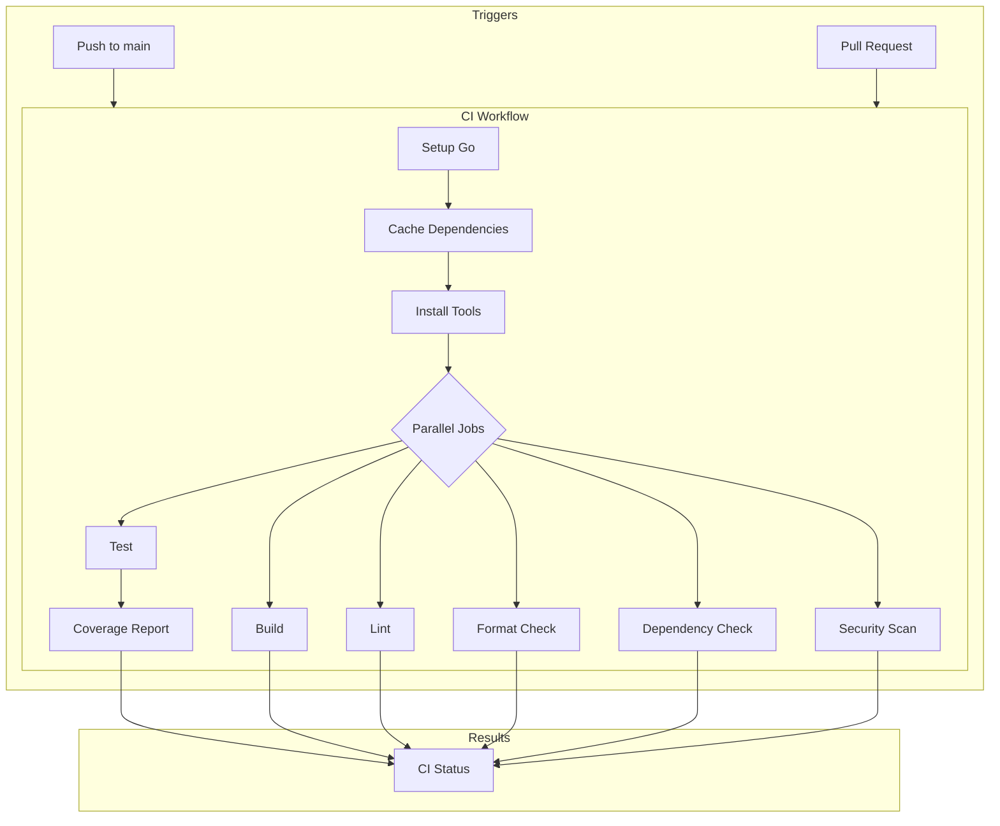

# Design Document: GitHub Actions CI

## Overview

S3 Tables CLI プロジェクトに GitHub Actions ベースの CI パイプラインを導入する。単一のワークフローファイルで、テスト、ビルド、静的解析、フォーマットチェック、依存関係検証、セキュリティスキャン、カバレッジレポートを実行する。

## Architecture



### ワークフロー構成

並列ジョブ構成を採用し、以下の理由から並列実行とする：

1. **実行時間短縮**: 各ジョブが同時に実行されるため、全体の CI 時間が短縮
2. **早期フィードバック**: 失敗したジョブが他のジョブを待たずに結果を返す
3. **キャッシュ共有**: `actions/setup-go@v5` の `cache: true` で各ジョブがキャッシュを共有

**ジョブ構成:**
- `test`: テスト実行 + カバレッジ生成
- `build`: ビルド検証
- `lint`: 静的解析
- `format`: フォーマットチェック
- `dependencies`: 依存関係チェック
- `security`: セキュリティスキャン
- `coverage`: カバレッジレポート（`test` ジョブ完了後に実行）

## Components and Interfaces

### 1. ワークフローファイル構成

```
.github/
└── workflows/
    └── ci.yml          # メイン CI ワークフロー

.golangci.yml           # golangci-lint 設定（プロジェクトルート）
```

### 2. CI ワークフロー（ci.yml）

```yaml
name: CI

on:
  push:
    branches: [main]
  pull_request:
    branches: ['*']

jobs:
  test:
    runs-on: ubuntu-latest
    steps:
      - uses: actions/checkout@v4
      - uses: actions/setup-go@v5
        with:
          go-version-file: 'go.mod'
          cache: true
      - name: Run tests
        run: go test -v -race -coverprofile=coverage.out ./...
      - uses: actions/upload-artifact@v4
        with:
          name: coverage
          path: coverage.out

  build:
    runs-on: ubuntu-latest
    steps:
      - uses: actions/checkout@v4
      - uses: actions/setup-go@v5
        with:
          go-version-file: 'go.mod'
          cache: true
      - name: Build
        run: go build -v ./...

  lint:
    runs-on: ubuntu-latest
    steps:
      - uses: actions/checkout@v4
      - uses: actions/setup-go@v5
        with:
          go-version-file: 'go.mod'
          cache: true
      - name: Lint
        uses: golangci/golangci-lint-action@v6

  format:
    runs-on: ubuntu-latest
    steps:
      - uses: actions/checkout@v4
      - uses: actions/setup-go@v5
        with:
          go-version-file: 'go.mod'
          cache: true
      - name: Check formatting
        run: |
          test -z "$(gofmt -l .)"
          test -z "$(go run golang.org/x/tools/cmd/goimports@latest -l .)"

  dependencies:
    runs-on: ubuntu-latest
    steps:
      - uses: actions/checkout@v4
      - uses: actions/setup-go@v5
        with:
          go-version-file: 'go.mod'
          cache: true
      - name: Check dependencies
        run: |
          go mod verify
          go mod tidy && git diff --exit-code go.mod go.sum

  security:
    runs-on: ubuntu-latest
    steps:
      - uses: actions/checkout@v4
      - uses: actions/setup-go@v5
        with:
          go-version-file: 'go.mod'
          cache: true
      - name: Security scan
        run: go run golang.org/x/vuln/cmd/govulncheck@latest ./...

  coverage:
    runs-on: ubuntu-latest
    needs: test
    steps:
      - uses: actions/checkout@v4
      - uses: actions/setup-go@v5
        with:
          go-version-file: 'go.mod'
          cache: true
      - uses: actions/download-artifact@v4
        with:
          name: coverage
      - name: Coverage report
        run: go tool cover -func=coverage.out
```

### 3. golangci-lint 設定（.golangci.yml）

基本的な lint ルールを設定：

- **errcheck**: エラーチェック漏れの検出
- **gosimple**: コード簡素化の提案
- **govet**: 疑わしいコンストラクトの検出
- **ineffassign**: 無効な代入の検出
- **staticcheck**: 静的解析
- **unused**: 未使用コードの検出

## Data Models

### ワークフロー設定モデル

| 項目 | 値 |
|------|-----|
| Go バージョン | go.mod から自動取得 |
| ランナー | ubuntu-latest |
| キャッシュ | Go モジュールキャッシュ（setup-go 組み込み） |
| タイムアウト | デフォルト（360分） |

### 各ステップの実行コマンド

| ステップ | コマンド |
|----------|----------|
| テスト | `go test -v -race -coverprofile=coverage.out ./...` |
| ビルド | `go build -v ./...` |
| Lint | `golangci-lint run` |
| gofmt チェック | `test -z "$(gofmt -l .)"` |
| goimports チェック | `test -z "$(go run golang.org/x/tools/cmd/goimports@latest -l .)"` |
| 依存関係検証 | `go mod verify` |
| 依存関係整合性 | `go mod tidy && git diff --exit-code go.mod go.sum` |
| セキュリティスキャン | `go run golang.org/x/vuln/cmd/govulncheck@latest ./...` |
| カバレッジレポート | `go tool cover -func=coverage.out` |


## Correctness Properties

*A property is a characteristic or behavior that should hold true across all valid executions of a system—essentially, a formal statement about what the system should do. Properties serve as the bridge between human-readable specifications and machine-verifiable correctness guarantees.*

### Property Analysis

この機能は GitHub Actions ワークフローの YAML 設定ファイルを作成するものであり、ランタイムで実行されるコードではない。そのため、プロパティベーステストの対象となる普遍的な性質は存在しない。

すべての受け入れ基準は設定ファイルの内容検証（example テスト）として検証可能：

- ワークフロートリガーの設定確認
- 各ステップのコマンド確認
- 設定ファイルの存在確認

### Testable Examples

以下の項目は設定ファイルの内容を確認することで検証可能：

1. **トリガー設定**: ci.yml に push/pull_request トリガーが含まれること
2. **Go バージョン**: go-version-file で go.mod を参照すること
3. **テストコマンド**: `-v -race -coverprofile=coverage.out ./...` フラグが含まれること
4. **ビルドコマンド**: `-v ./...` フラグが含まれること
5. **Lint 設定**: golangci-lint run コマンドと .golangci.yml ファイルが存在すること
6. **フォーマットチェック**: gofmt と goimports のチェックコマンドが含まれること
7. **依存関係チェック**: go mod verify と go mod tidy + git diff コマンドが含まれること
8. **セキュリティスキャン**: govulncheck コマンドが含まれること
9. **カバレッジレポート**: go tool cover -func コマンドが含まれること

## Error Handling

### ワークフロー失敗時の動作

| 失敗ステップ | 動作 | 対処方法 |
|-------------|------|----------|
| テスト失敗 | ワークフロー失敗 | テストを修正 |
| ビルド失敗 | ワークフロー失敗 | コンパイルエラーを修正 |
| Lint 失敗 | ワークフロー失敗 | lint 警告を修正 |
| フォーマット失敗 | ワークフロー失敗 | `gofmt -w .` と `goimports -w .` を実行 |
| 依存関係失敗 | ワークフロー失敗 | `go mod tidy` を実行してコミット |
| セキュリティ失敗 | ワークフロー失敗 | 脆弱性のある依存関係を更新 |

### エラーメッセージの明確化

各ステップに `name` を設定し、失敗時にどのチェックが失敗したか明確にする。

## Testing Strategy

### 検証方法

この機能は設定ファイル（YAML）の作成であるため、以下の方法で検証する：

1. **手動検証**: 
   - PR を作成して CI が実行されることを確認
   - main ブランチへの push で CI が実行されることを確認

2. **設定ファイルの構文検証**:
   - YAML の構文が正しいこと
   - GitHub Actions の構文に準拠していること

3. **各ステップの動作確認**:
   - 意図的にテストを失敗させて CI が失敗することを確認
   - 意図的にフォーマットを崩して CI が失敗することを確認

### プロパティベーステスト

この機能はランタイムコードではなく設定ファイルの作成であるため、プロパティベーステストは適用しない。
