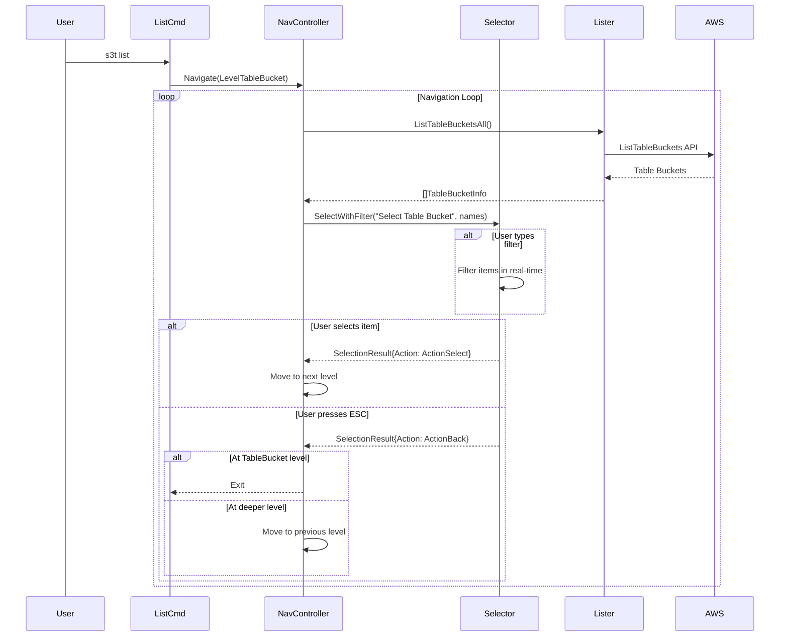
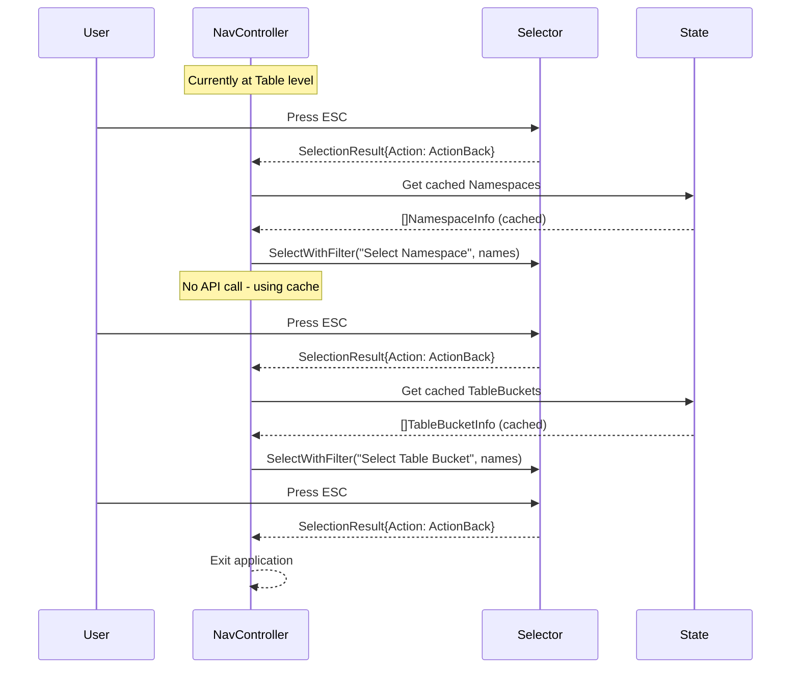

# Design Document: S3 Tables List Command

## Overview

S3 Tables CLI の `list` サブコマンドを拡張し、Interactive_Selector 内でのリアルタイムフィルタリングと ESC キーによる階層ナビゲーションを実装する。

現在の実装では `--filter` CLI オプションを使用しているが、これを Interactive_Selector 内のリアルタイム検索に変更し、より直感的な操作性を提供する。

## Architecture

### コンポーネント構成

```
┌─────────────────────────────────────────────────────────────┐
│                      cmd/list.go                            │
│  - CLI エントリーポイント                                    │
│  - 引数解析と初期階層の決定                                  │
│  - NavigationController の呼び出し                          │
└─────────────────────────────────────────────────────────────┘
                              │
                              ▼
┌─────────────────────────────────────────────────────────────┐
│              internal/s3tables/navigator.go                 │
│  - NavigationController: 階層間の遷移管理                   │
│  - NavigationState: 現在の状態とキャッシュ管理              │
│  - ESC キーによる戻る機能の制御                             │
└─────────────────────────────────────────────────────────────┘
                              │
              ┌───────────────┼───────────────┐
              ▼               ▼               ▼
┌─────────────────┐ ┌─────────────────┐ ┌─────────────────┐
│   selector.go   │ │   lister.go     │ │   filter.go     │
│ InteractiveUI   │ │ AWS API呼び出し │ │ パターンマッチ  │
└─────────────────┘ └─────────────────┘ └─────────────────┘
```


## Components and Interfaces

### NavigationController

階層間のナビゲーションを管理するコントローラー。

```go
// NavigationLevel represents the current navigation level
type NavigationLevel int

const (
    LevelTableBucket NavigationLevel = iota
    LevelNamespace
    LevelTable
)

// NavigationState holds the current navigation state and cached data
type NavigationState struct {
    Level           NavigationLevel
    TableBuckets    []TableBucketInfo  // キャッシュされた Table Bucket 一覧
    Namespaces      []NamespaceInfo    // キャッシュされた Namespace 一覧
    Tables          []TableInfo        // キャッシュされた Table 一覧
    SelectedBucket  string             // 選択された Table Bucket 名
    SelectedBucketARN string           // 選択された Table Bucket ARN
    SelectedNamespace string           // 選択された Namespace 名
}

// NavigationController manages hierarchical navigation
type NavigationController struct {
    lister   *S3TablesLister
    selector InteractiveSelector
    state    *NavigationState
}

// Navigate starts the navigation from the specified level
func (c *NavigationController) Navigate(ctx context.Context, startLevel NavigationLevel) error

// navigateTableBuckets handles Table Bucket level navigation
func (c *NavigationController) navigateTableBuckets(ctx context.Context) (NavigationAction, error)

// navigateNamespaces handles Namespace level navigation
func (c *NavigationController) navigateNamespaces(ctx context.Context) (NavigationAction, error)

// navigateTables handles Table level navigation
func (c *NavigationController) navigateTables(ctx context.Context) (NavigationAction, error)
```

### InteractiveSelector (拡張)

リアルタイムフィルタリングと ESC キーをサポートする拡張セレクター。

```go
// SelectionResult represents the result of a selection
type SelectionResult struct {
    Selected string           // 選択されたアイテム
    Action   NavigationAction // 実行されたアクション
}

// NavigationAction represents the action taken by the user
type NavigationAction int

const (
    ActionSelect NavigationAction = iota  // アイテムを選択
    ActionBack                            // ESC で戻る
    ActionExit                            // 終了
)

// InteractiveSelector provides interactive selection with filtering
type InteractiveSelector interface {
    // SelectWithFilter displays items with real-time filtering
    // Returns the selected item and the action taken
    SelectWithFilter(label string, items []string) (*SelectionResult, error)
}
```


### FilterablePromptSelector

promptui を使用したフィルタリング対応セレクターの実装。

```go
// FilterablePromptSelector implements InteractiveSelector with filtering
type FilterablePromptSelector struct{}

// NewFilterablePromptSelector creates a new FilterablePromptSelector
func NewFilterablePromptSelector() *FilterablePromptSelector

// SelectWithFilter displays a selection prompt with real-time filtering
func (s *FilterablePromptSelector) SelectWithFilter(label string, items []string) (*SelectionResult, error) {
    // promptui.Select の Searcher 機能を使用
    // ESC キー (^C) で ActionBack を返す
    // Enter で選択したアイテムと ActionSelect を返す
}
```

## Data Models

### 既存モデル（変更なし）

```go
// TableBucketInfo - Table Bucket のメタデータ
type TableBucketInfo struct {
    Name      string
    ARN       string
    CreatedAt time.Time
}

// NamespaceInfo - Namespace のメタデータ
type NamespaceInfo struct {
    Name      string
    CreatedAt time.Time
}

// TableInfo - Table のメタデータ
type TableInfo struct {
    Name      string
    ARN       string
    Namespace string
    CreatedAt time.Time
    Type      string
}
```

### 新規モデル

```go
// NavigationState - ナビゲーション状態
type NavigationState struct {
    Level             NavigationLevel
    TableBuckets      []TableBucketInfo
    Namespaces        []NamespaceInfo
    Tables            []TableInfo
    SelectedBucket    string
    SelectedBucketARN string
    SelectedNamespace string
}

// SelectionResult - 選択結果
type SelectionResult struct {
    Selected string
    Action   NavigationAction
}
```

## Sequence Diagram

### 基本フロー（引数なしで実行）




### ESC キーによる戻るフロー



## Implementation Details

### promptui でのフィルタリング実装

promptui の `Select` には `Searcher` 機能があり、これを使用してリアルタイムフィルタリングを実装する。
入力は自動的に部分一致（substring）検索として扱われる。

```go
func (s *FilterablePromptSelector) SelectWithFilter(label string, items []string) (*SelectionResult, error) {
    searcher := func(input string, index int) bool {
        item := strings.ToLower(items[index])
        input = strings.ToLower(input)
        
        // 自動的に部分一致検索（*input* と同等）
        return strings.Contains(item, input)
    }

    prompt := promptui.Select{
        Label:             label,
        Items:             items,
        Size:              10,
        Searcher:          searcher,
        StartInSearchMode: false,
    }

    idx, _, err := prompt.Run()
    if err != nil {
        if err == promptui.ErrInterrupt {
            return &SelectionResult{Action: ActionBack}, nil
        }
        return nil, err
    }

    return &SelectionResult{
        Selected: items[idx],
        Action:   ActionSelect,
    }, nil
}
```

### NavigationController の状態管理

```go
func (c *NavigationController) Navigate(ctx context.Context, startLevel NavigationLevel) error {
    c.state.Level = startLevel

    for {
        var action NavigationAction
        var err error

        switch c.state.Level {
        case LevelTableBucket:
            action, err = c.navigateTableBuckets(ctx)
            if err != nil {
                return err
            }
            if action == ActionBack {
                return nil // Exit application
            }
            if action == ActionSelect {
                c.state.Level = LevelNamespace
            }

        case LevelNamespace:
            action, err = c.navigateNamespaces(ctx)
            if err != nil {
                return err
            }
            if action == ActionBack {
                c.state.Level = LevelTableBucket
                continue
            }
            if action == ActionSelect {
                c.state.Level = LevelTable
            }

        case LevelTable:
            action, err = c.navigateTables(ctx)
            if err != nil {
                return err
            }
            if action == ActionBack {
                c.state.Level = LevelNamespace
                continue
            }
            // Table 選択後は詳細表示して終了
            return nil
        }
    }
}
```


## Correctness Properties

*A property is a characteristic or behavior that should hold true across all valid executions of a system—essentially, a formal statement about what the system should do. Properties serve as the bridge between human-readable specifications and machine-verifiable correctness guarantees.*

### Property 1: Navigation level determines correct resource listing

*For any* starting navigation level (TableBucket, Namespace, or Table) and corresponding arguments, the NavigationController SHALL call the appropriate AWS API and return the correct resource type.

- Starting at LevelTableBucket → ListTableBuckets API → []TableBucketInfo
- Starting at LevelNamespace with bucket → ListNamespaces API → []NamespaceInfo
- Starting at LevelTable with bucket and namespace → ListTables API → []TableInfo

**Validates: Requirements 1.1, 1.2, 2.1, 2.2, 3.1, 3.2**

### Property 2: Selection advances navigation to next level

*For any* selection action at TableBucket or Namespace level, the NavigationController SHALL advance to the next hierarchical level.

- Selection at LevelTableBucket → advances to LevelNamespace
- Selection at LevelNamespace → advances to LevelTable

**Validates: Requirements 1.3, 2.3**

### Property 3: Filter correctly filters items by pattern

*For any* filter pattern and list of items, the LikeFilter SHALL return only items that contain the pattern as a substring (case-insensitive). An empty pattern SHALL return all items.

- Empty pattern "" → returns all items unchanged
- Pattern "abc" → returns items containing "abc" anywhere (case-insensitive)
- Pattern with no matches → returns empty list

**Validates: Requirements 4.1, 4.2, 4.5**

### Property 4: Substring matching is automatic

*For any* input pattern, the filter SHALL automatically perform substring matching without requiring explicit wildcards. The input "test" SHALL match "test", "mytest", "testing", "mytesting".

**Validates: Requirements 4.2**

### Property 5: ESC navigates back one level

*For any* navigation level except TableBucket, pressing ESC SHALL return to the previous level without making API calls.

- ESC at LevelTable → returns to LevelNamespace
- ESC at LevelNamespace → returns to LevelTableBucket
- ESC at LevelTableBucket → exits application

**Validates: Requirements 7.1, 7.2, 7.3**

### Property 6: Back navigation uses cached data

*For any* back navigation action, the NavigationController SHALL use previously cached resource data without making additional API calls.

- After navigating Bucket → Namespace → Table, pressing ESC twice should not trigger any API calls
- Cached data should be identical to originally fetched data

**Validates: Requirements 7.4**

## Error Handling

### AWS API Errors

既存の `WrapError` 関数を使用して、AWS API エラーをユーザーフレンドリーなメッセージに変換する。

```go
// 既存のエラーハンドリングを継続使用
if err != nil {
    return WrapError("ListTableBuckets", err)
}
```

### リソース未検出

リソースが見つからない場合は、明確なメッセージを表示する。

```go
if len(buckets) == 0 {
    fmt.Println("No table buckets found")
    return nil
}
```

### 選択キャンセル（ESC）

ESC キーによるキャンセルはエラーではなく、正常なナビゲーションアクションとして処理する。

```go
if err == promptui.ErrInterrupt {
    return &SelectionResult{Action: ActionBack}, nil
}
```


## Testing Strategy

### テストフレームワーク

- **ユニットテスト**: Go 標準の `testing` パッケージ
- **プロパティベーステスト**: `github.com/leanovate/gopter`

### テストアプローチ

#### ユニットテスト

特定のシナリオとエッジケースをテスト：

1. 空のリソースリストの処理
2. 存在しないリソースへのアクセス
3. テーブル詳細の表示フォーマット

#### プロパティベーステスト

普遍的な性質を多数の入力でテスト：

1. **Property 1**: ナビゲーションレベルとリソース取得の対応
2. **Property 2**: 選択による次レベルへの遷移
3. **Property 3**: フィルタリングの正確性
4. **Property 4**: ワイルドカードパターンマッチング
5. **Property 5**: ESC による戻るナビゲーション
6. **Property 6**: キャッシュデータの使用

### プロパティテスト設定

- 各プロパティテストは最低 100 回の反復を実行
- 各テストは設計ドキュメントのプロパティを参照するコメントを含む
- タグ形式: `**Feature: s3t-list, Property N: [property_text]**`

### モック戦略

```go
// MockS3TablesAPI for testing
type MockS3TablesAPI struct {
    ListTableBucketsFunc func(ctx context.Context, input *s3tables.ListTableBucketsInput) (*s3tables.ListTableBucketsOutput, error)
    ListNamespacesFunc   func(ctx context.Context, input *s3tables.ListNamespacesInput) (*s3tables.ListNamespacesOutput, error)
    ListTablesFunc       func(ctx context.Context, input *s3tables.ListTablesInput) (*s3tables.ListTablesOutput, error)
    GetTableFunc         func(ctx context.Context, input *s3tables.GetTableInput) (*s3tables.GetTableOutput, error)
}

// MockInteractiveSelector for testing navigation
type MockInteractiveSelector struct {
    SelectWithFilterFunc func(label string, items []string) (*SelectionResult, error)
    CallCount            int
}
```

### テストファイル構成

```
internal/s3tables/
├── navigator_test.go           # NavigationController のユニットテスト
├── navigator_property_test.go  # NavigationController のプロパティテスト
├── selector_test.go            # InteractiveSelector のユニットテスト
├── filter_property_test.go     # LikeFilter のプロパティテスト（既存を拡張）
```

## CLI Changes

### --filter オプションの削除

現在の `--filter` CLI オプションを削除し、Interactive_Selector 内のリアルタイムフィルタリングに置き換える。

```go
// Before (削除)
listCmd.Flags().StringVarP(&filterPattern, "filter", "f", "", "Filter pattern...")

// After
// フィルタリングは Interactive_Selector 内で実行
```

### ヘルプテキストの更新

```go
Long: `List S3 Tables resources (Table Bucket, Namespace, Table) hierarchically.

Arguments are optional:
  - No arguments: List all table buckets, then interactively navigate
  - table-bucket: List namespaces in the specified bucket
  - table-bucket namespace: List tables in the specified namespace
  - table-bucket namespace table: Show table details

Interactive Features:
  - Type to filter: Start typing to filter resources in real-time
  - ESC: Go back to previous level (or exit at top level)
  - Enter: Select the highlighted resource

Examples:
  # List all table buckets interactively
  s3t list

  # Start from a specific bucket
  s3t list my-bucket

  # Show details of a specific table
  s3t list my-bucket my-namespace my-table`,
```
