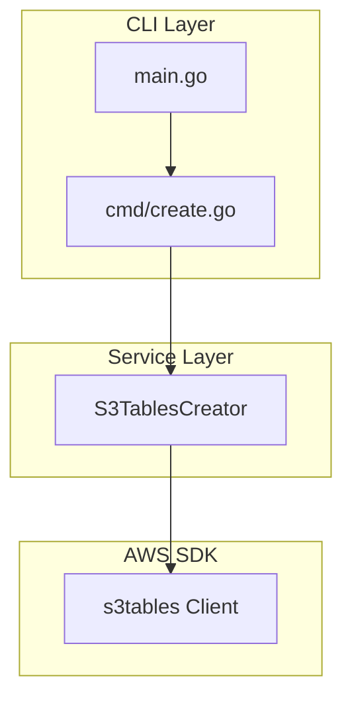
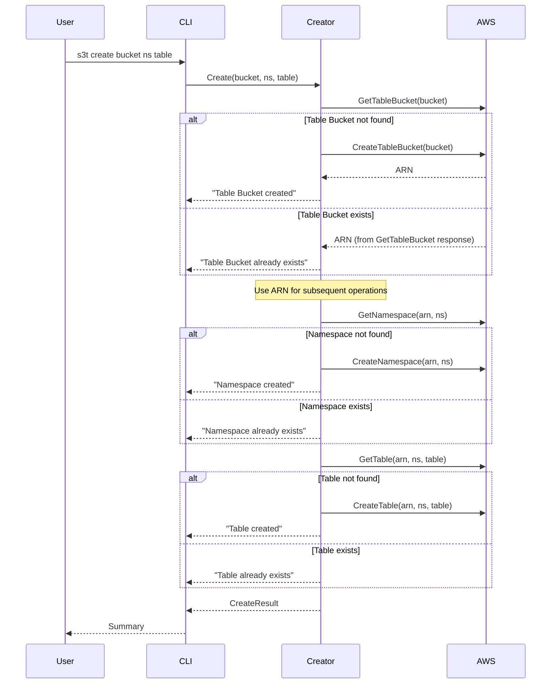

# Design Document: S3 Tables CLI

## Overview

GoベースのCLIツールで、Amazon S3 Tablesリソース（Table Bucket、Namespace、Table）を階層的に作成する。AWS SDK for Go v2を使用し、既存リソースの検出と適切な通知を行いながら、必要なリソースのみを作成する。

## Architecture



CLIはCobraを使用したコマンドライン処理、サービス層でのビジネスロジック、AWS SDKとの通信という3層構造を採用する。

## Components and Interfaces

### 1. CLI Layer (cmd/create.go)

```go
// CreateCmd はcreateサブコマンドを定義
var CreateCmd = &cobra.Command{
    Use:   "create <table-bucket> <namespace> <table>",
    Short: "Create S3 Tables resources",
    Args:  cobra.ExactArgs(3),
    RunE:  runCreate,
}

func runCreate(cmd *cobra.Command, args []string) error
```

### 2. Service Layer (internal/s3tables/creator.go)

```go
// S3TablesCreator はS3 Tablesリソースの作成を管理
type S3TablesCreator struct {
    client S3TablesAPI
}

// S3TablesAPI はAWS S3 Tables APIのインターフェース
type S3TablesAPI interface {
    GetTableBucket(ctx context.Context, params *s3tables.GetTableBucketInput, optFns ...func(*s3tables.Options)) (*s3tables.GetTableBucketOutput, error)
    CreateTableBucket(ctx context.Context, params *s3tables.CreateTableBucketInput, optFns ...func(*s3tables.Options)) (*s3tables.CreateTableBucketOutput, error)
    GetNamespace(ctx context.Context, params *s3tables.GetNamespaceInput, optFns ...func(*s3tables.Options)) (*s3tables.GetNamespaceOutput, error)
    CreateNamespace(ctx context.Context, params *s3tables.CreateNamespaceInput, optFns ...func(*s3tables.Options)) (*s3tables.CreateNamespaceOutput, error)
    GetTable(ctx context.Context, params *s3tables.GetTableInput, optFns ...func(*s3tables.Options)) (*s3tables.GetTableOutput, error)
    CreateTable(ctx context.Context, params *s3tables.CreateTableInput, optFns ...func(*s3tables.Options)) (*s3tables.CreateTableOutput, error)
}

// CreateResult は作成結果を表す
type CreateResult struct {
    TableBucketCreated bool
    TableBucketARN     string
    NamespaceCreated   bool
    TableCreated       bool
    TableARN           string
}

// Create は階層的にリソースを作成
func (c *S3TablesCreator) Create(ctx context.Context, tableBucket, namespace, table string) (*CreateResult, error)
```

### 3. 処理フロー



**ARN取得フロー**:
- CLI引数ではTable Bucket名を受け取る
- GetTableBucket APIまたはCreateTableBucket APIのレスポンスからARNを取得
- 取得したARNをNamespaceおよびTable操作に使用

## Data Models

### CreateInput

```go
type CreateInput struct {
    TableBucket string // Table Bucket名 (3-63文字, [0-9a-z-])
    Namespace   string // Namespace名 (1-255文字, [0-9a-z_])
    Table       string // Table名 (1-255文字, [0-9a-z_])
}
```

### 入力バリデーション

| フィールド | 最小長 | 最大長 | パターン |
|-----------|--------|--------|----------|
| TableBucket | 3 | 63 | `[0-9a-z-]*` |
| Namespace | 1 | 255 | `[0-9a-z_]*` |
| Table | 1 | 255 | `[0-9a-z_]*` |

## Correctness Properties

*A property is a characteristic or behavior that should hold true across all valid executions of a system-essentially, a formal statement about what the system should do. Properties serve as the bridge between human-readable specifications and machine-verifiable correctness guarantees.*

### Property 1: 入力バリデーションの一貫性

*For any* input string, the validation function should return true if and only if the string matches the AWS API constraints (length and pattern).

**Validates: Requirements 4.3**

### Property 2: 既存リソース検出の正確性

*For any* resource state (existing or not), the Creator should correctly identify whether each resource exists and only attempt creation for non-existing resources.

**Validates: Requirements 1.2, 2.2, 3.2**

### Property 3: 階層的作成の順序保証

*For any* valid input, the Creator should attempt to create resources in the correct order: Table Bucket → Namespace → Table, and should not attempt to create child resources if parent creation fails.

**Validates: Requirements 1.1, 2.1, 3.1**

## Error Handling

### エラー種別と対応

| エラー種別 | HTTPステータス | 対応 |
|-----------|---------------|------|
| NotFoundException | 404 | リソースが存在しない（作成を試行） |
| ConflictException | 409 | リソースが既に存在（通知して続行） |
| ForbiddenException | 403 | 認証エラー（エラーメッセージを表示） |
| BadRequestException | 400 | 入力エラー（バリデーションエラーを表示） |
| InternalServerErrorException | 500 | サーバーエラー（リトライを推奨） |

### エラーメッセージ形式

```
Error: [操作]: [詳細メッセージ]
例: Error: CreateTableBucket: access denied - check your AWS credentials
```

## Testing Strategy

### テストフレームワーク

- 単体テスト: Go標準の`testing`パッケージ
- プロパティベーステスト: `github.com/leanovate/gopter`
- モック: インターフェースベースのモック実装

### テスト構成

1. **単体テスト**: 各コンポーネントの個別機能をテスト
   - 入力バリデーション
   - エラーハンドリング
   - モックを使用したCreatorのロジック

2. **プロパティベーステスト**: 正当性プロパティを検証
   - Property 1: バリデーション関数の一貫性
   - Property 2: 既存リソース検出の正確性
   - Property 3: 階層的作成の順序保証

### テスト実行

```bash
go test ./... -v
go test ./... -v -run Property  # プロパティテストのみ
```
